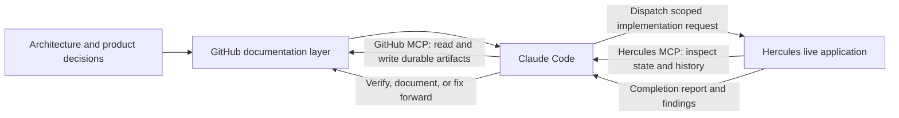

# Reiliz: Claude Code + MCP Delivery Case Study

This repository is a **sanitized technical showcase** of the AI-native delivery workflow used to build and operate Reiliz, a multi-tenant CRM and operating platform for wholesale real estate investors.

It demonstrates how Claude Code can coordinate durable product documentation in GitHub with a live application environment in Hercules through MCP connectors—without exposing Reiliz source code, customer information, credentials, production configuration, or proprietary internal records.

## Product

Reiliz supports lead management, pipeline workflows, tasks, unified communications, Twilio voice and SMS, Google OAuth, Gmail, Google Calendar, background automation, and internal AI-assisted functionality.

- Product site: https://reiliz.com
- A demonstration workspace can be provided to qualified reviewers on request.

## The delivery problem

The live React and Convex application is maintained in Hercules, while GitHub holds the durable architecture, design specifications, implementation instructions, operating procedures, and decision history.

The core requirement was to prevent AI agents from working from stale assumptions while also preserving a maintainable system of record outside a chat session.

## Solution architecture

## Claude Code's role

Claude Code is used as the detailed analysis, authoring, and orchestration layer. A typical implementation cycle is:

1. Read relevant architecture decisions, design specifications, prior implementation artifacts, and operating rules from GitHub.
2. Query the live Hercules application and prior implementation threads through MCP.
3. Reconcile the documented desired state with the actual deployed state.
4. Create a scoped implementation artifact with explicit acceptance criteria, exclusions, preservation requirements, and verification steps.
5. Commit the artifact to GitHub as a durable record.
6. Dispatch the approved work to Hercules through MCP.
7. Review the completion report and manage diagnostic or fix-forward iterations.

## Why this matters

This model separates responsibilities instead of expecting one AI agent to perform every job equally well:

- **GitHub** provides durable decisions, specifications, traceability, and recovery material.
- **Claude Code** performs grounded analysis and produces implementation-ready artifacts.
- **Hercules** works against the live React and Convex application.
- **Human approval boundaries** govern net-new product changes and sensitive operations.

The result is a repeatable workflow that reduces manual handoffs, stale-context errors, undocumented decisions, and unverified AI-generated changes.

## Repository contents

- [`docs/ARCHITECTURE.md`](docs/ARCHITECTURE.md) — component roles, data flow, and control boundaries.
- [`docs/WORKFLOW-AUDIT-METHOD.md`](docs/WORKFLOW-AUDIT-METHOD.md) — method for identifying and prioritizing business automation opportunities.
- [`docs/SANITIZATION-CHECKLIST.md`](docs/SANITIZATION-CHECKLIST.md) — controls used before sharing technical work.
- [`examples/sanitized-build-prompt.md`](examples/sanitized-build-prompt.md) — representative Claude-to-Hercules implementation artifact.
- [`examples/mcp-connection-manifest.example.json`](examples/mcp-connection-manifest.example.json) — non-secret conceptual MCP connection manifest.

## Important limitations

This repository intentionally contains:

- No production source code
- No database exports
- No customer, lead, tenant, or pilot-user data
- No credentials, tokens, webhook URLs, account identifiers, or production endpoints
- No complete internal architecture-decision or implementation history
- No proprietary schema or function signatures

The examples preserve the workflow structure while replacing sensitive implementation details with representative placeholders.

## Ownership and use

Copyright © 2026 Proceptra LLC. All rights reserved.

This repository is supplied for evaluation and discussion. No license is granted to copy, redistribute, deploy, or create derivative products from these materials.
